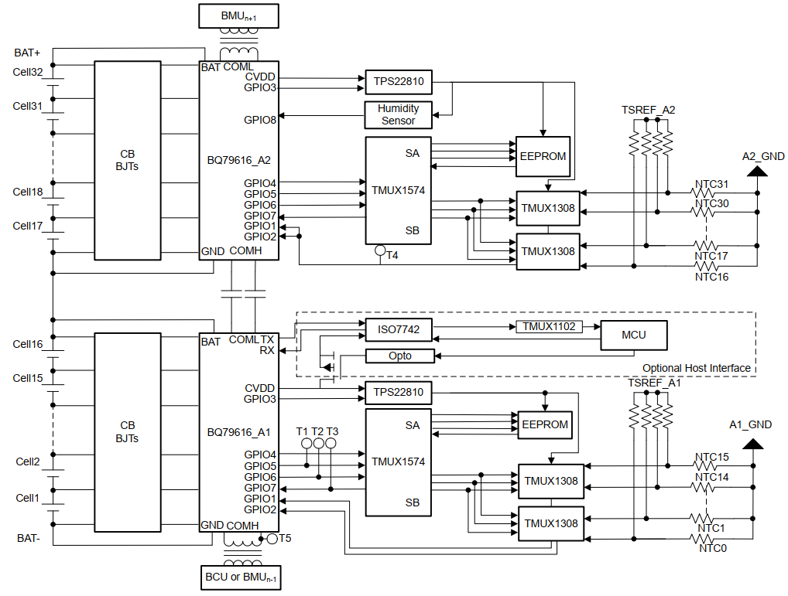

# **1. Introduct product**
This product is a full cell-temperature sensing and high cell-voltage accuracy Lithium-ion:
- 32 battery pack
- cost-effective
- high-capacity
---
# **2. Features**
- ± 1.5mV voltage accuracy at 25°C without calibration
- Balancing up to 100mA, support external balacing circuit
- Full cell-temperature sensing with MUX
- Robust and programmable battery cell and pack protectionPack protection
- Robust daisy-chain communication with data
reclocking and ring architecture
- 15uA in shutdown mode
- Isolate **UART** interface for microcontroller and **CAN** network communication
---
# **3. Applications**
- *Battery energy storage system*
- *Other industrial battery pack (>10S)*
---
# **4. Design System**
## **4.1 System Overview**
- This is block diagram of system:

  

| Device | BQ79616 | TMUX1574 | TMUX1308 |
| --- | --- | --- | --- |
|**Feature**|Monitor voltage and temperature; Protect overvoltage, undervoltage, overtemperature|Expand GPIO4 through GPIO7 of BQ79616 to an external SPI EEPROM (restores pack information)|Expand temperature-sensing of BQ79616 from 8 channel to 16 channel|
|**Pins**|8xGPIO for temperature sensing and 16xVC for voltage sensing||a TMUX1308 connect one at a time to the TSREF output pin of BQ79616|

**Note**: 
- *TSREF is set at a high or low level*
- *The BCU then polls the MUX channels and determines if the voltage reported on the MUX channel connected to TSREF matches the TSREF pin output -> MUX is stuck on a specific channel or reporting voltages corresponding to incorrect channels*
- *GPIO8 of BQ79616 is reserved for humidity sensor interface.*
- *CVDD pin on BQ79616 is used to supply power to the TMUX1308, TMUX1574, external EEPROM and humidity sensor -> This is cause leakage current to external load when the BQ79616 is in **SHUTDOWN** mode* -> Using **TPS22810** is ennabled by GPIO3 of BQ79616 and the device is used to switch the power supply output from CVDD to prevent unintended leakage current.
- ***BQ79616*** *supports the UART interface to the MCU*
- ***ISO7742*** *is placed between the BQ79616 and MCU to **isolate** the TX and RX pins of each device. Since the TX and CVDD pins of the BQ79616 are constanton power supply, **These pins can cause leakage current to the ISO8842 in SHUTDOWN mode** PMOS TMUX1102, and optocoupler are used to block the leakage current -> **To initiate UART communication, the MCU, needs enable the optocoupler to switch on the PMOS and TMUX1102 from MCU side**.*
- *This design also uses a **BJT network** for external passive cell balancing, have internal resister can support up to 100mA of balancing current. -> **The voltage across the internal passive cell balancing resistors are used to switch ON the external BJTs for passive cell balancing.***
- *To isolate communication, the design uses two high-voltage capacitors for daisy chain communication between two BQ79616 and two transformers in daisy chain communication between the BMUs or the BCU.*

## **4.2 Multiplexer Network and Switch Strategy**

  

*This image is showing the strategy of reading all thermistors and cell voltages.*

**Detail:**
- 2x TMUX1308 are used to multiplex 16 Negative Temprature Coefficient (NTC) thermistors to one BQ79616 -> ***Using three pins GPIO (GPIO5, GPIO6, GPIO7) to address the 8 NTC thermistor channels of TMUX1308 - 5 GPIOs can switch 16 NTC thermistor, if more thermistors are required, 6 GPIOs can switch 24 NTC thermistors.***

- *And now, we can easily increased using the TMUX1308 or other multiplexer.*

- The loop of NTC thermistor switching consists of a broadcast write to all stacked BQ79616 GPIO5 to 7 pins / broadcast read of the TSREF and GPIO1 to GPIO2. -> This design need 8 loop for 16 NTC thermistors. **The number of stacked BMUs is N, using BQ796xx:

|time write in loop (us)|time read in loop (us)|
| --- | --- |
|(14 + 4 × 2 × N_BMU − 1 + 60)|(14 + 4 × 2 × N_BMU − 1 + 60 + 14 + 4 × 2 × N_BMU − 1 + 90 × 2 × N_BMU)|

**Standard GBT34131-2023** *(100ms for VCELL and 1s NTC thermistors)*

**Ex:** BESS rack voltage = 1500V, one rack consists of 470 pieces of battery cells (psc) in series -> using 15 BMUs (30 BQ79616 divices) to monitor all battery cells. -> **One loop to read temperature data is 4.11ms (BQ79616 read BQ79616); Read temperature of all 16 (8 couple) NTC thermistors is 4.11 x 8 = 38.88ms; 11.706ms is required to read the cell voltage (VCELL) data of all stacked BQ79616 devices. -> Total time for 1500V rack: 4.11 + 38.88 + 11.706 = 44ms.**

## **4.3 Cell Balancing - CB block**

  

- Using FET to achieve 100mA balancing current
- CB block decreate from 3.5V input to 3.3V output
- To achieve 100mA white CB voltage is 3.5V, Rcb6 = Rcb5 = 15(Ohm).
- When using NPN transistor, Rb needs two condition:

*1. NPN transistor work in the saturation region for a small heat dissipation area.*

*2. UBE > UBE(on), UBE(on) must be smaller than the voltage across the Rcb5 and  as small as possible to enable an easy selection of Rb.*

***This design using Rb = 300 Ohm can support cell balancing current up to 600mA.***

## **4.4 Stacked AFE Communication**

  

*BQ79616 support both the forward and reverse communication direction.*
- BCU issues pings to the BQ79600 using SPI interface.
- Pings are non-comm signals for simple actions (WAKE and SHUTDOWN mode).
- BQ7900 can send and receive tones to and from the stacked BQ79616 in the North and South in a duty cycle.
- Considering the **GBT34131-2023 standards**, the voltage cycle need to be less than 100ms,and the temperature cycle ness to be less than 1s.

## **4.5 Isolated UART Interface to MCU**

  

The design reserves an isolated UART interface to the MCU for a CAN structure.

*-> ISO7742 is used connect the UART interface of BQ9616 and the MCU*

  

- TMUX1102 is used to block the current from the TX pin (powered-off protection, and high bandwidth of 300 MHz)
- Both TMUX1102 and PMOS are enabled by an optocoupler pulldown signal controlled by th MCU.

## **4.6 Other**

All other information reference to [Design_Guide.pdf](/Datasheets/Design_Guide.pdf)

# **5. Detail Design**
## **5.1 Block diagram**

  

## **5.2 Schematic**
**In this project, I use Kicad 7.0 for layout and design.**

(UPDATE LATE)

## **5.3 PCB layout**

(UPDATE LATE)

## **5.4 Other**

All information reference at [Schematic.pdf](/Datasheets/Schematic.PDF)

# **6. Test**
## **6.1 Test Setup**

## **6.2 Test Result**

## **6.3 Other**
All test result reference at [Design_Guide.pdf](/Datasheets/Design_Guide.pdf)

# **7. Reference**
- [This project](https://github.com/toan20172852/Kicad-Stackable_battery_management_unit_reference_design_for_energy_storage_systems)
- [Reference](https://www.ti.com/tool/TIDA-010271#design-products)